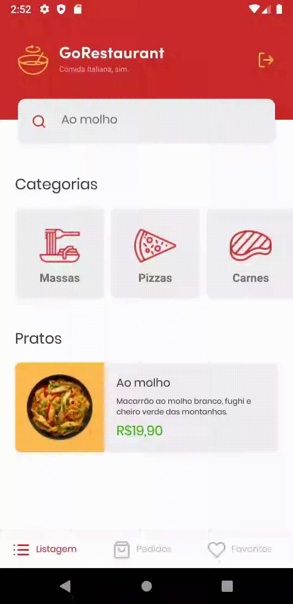

<h1 align="center">
  
</h1>

<p align="center">
  
  
  
  
  
</p>

<p align="center">
  <a href="#information_source-how-to-use">ℹ️ How To Use</a>&nbsp;&nbsp;&nbsp;|&nbsp;&nbsp;&nbsp;
  <a href="#rocket-technologies">🚀 Technologies</a>&nbsp;&nbsp;&nbsp;|&nbsp;&nbsp;&nbsp;
  <a href="#computer-author">💻 Author</a>&nbsp;&nbsp;&nbsp;|&nbsp;&nbsp;&nbsp;
  <a href="#memo-license">📝 License</a>
</p>

<p align="center">
  GoRestaurant is a project developed in React Native and TypeScript as a challenge in Rocketseat's GoStack 11 Bootcamp.
</p>

---

<h1 align="center">
  

  
</h1>

# :information_source: How To Use

Clone the repository

```bash
https://github.com/tavareshenrique/go-restaurant-mobile
```

```bash
# Install the dependencies
yarn
# or
npm install

# Start the JSON Server
json-server server.json -p 3333

# Install the app in Android or iOS
yarn android
# or
yarn ios

# Run the app
yarn start
```

# :rocket: Technologies

- [React Native](https://reactnative.dev/)
- [TypeScript](https://www.typescriptlang.org/)
- [axios](https://github.com/axios/axios)
- [react-native-gesture-handler](https://github.com/software-mansion/react-native-gesture-handler)
- [react-native-safe-area-context](https://github.com/th3rdwave/react-native-safe-area-context)
- [react-native-screens](https://github.com/software-mansion/react-native-screens)
- [react-native-vector-icons](https://github.com/oblador/react-native-vector-icons)
- [styled-components](https://styled-components.com/)
- [ESLint](https://eslint.org/)
- [Prettier](https://prettier.io/)
- [JSON Server](https://github.com/typicode/json-server)

# :computer: Author

<table>
  <tr>
    <td align="center">
      <a href="http://github.com/tavareshenrique/">
        
        <br />
        <sub>
          <b>Henrique Tavares</b>
        </sub>
       </a>
       <br />
       <a href="https://www.linkedin.com/in/tavareshenrique/" title="Linkedin">@tavareshenrique</a>
       <br />
       <a href="https://github.com/tavareshenrique/
                go-restaurant-mobile/commits?author=tavareshenrique" title="Code">💻</a>
    </td>
    <td align="center">
      <a href="https://github.com/Rocketseat/">
        
        <br />
        <sub>
          <b>Rocketseat</b>
        </sub>
       </a>
       <br />
       <a href="https://www.linkedin.com/in/tavareshenrique/" title="Linkedin">@Rocketseat</a>
       <br />
       <a href="https://github.com/tavareshenrique/go-restaurant-mobile/commits?author=tavareshenrique" title="Code">💻</a>
    </td>
  </tr>
</table>

# :memo: License

This project is licensed under the MIT license - see the archive [LICENSE.md](https://github.com/tavareshenrique/go-restaurant-mobile/blob/master/LICENSE.md) for details.
